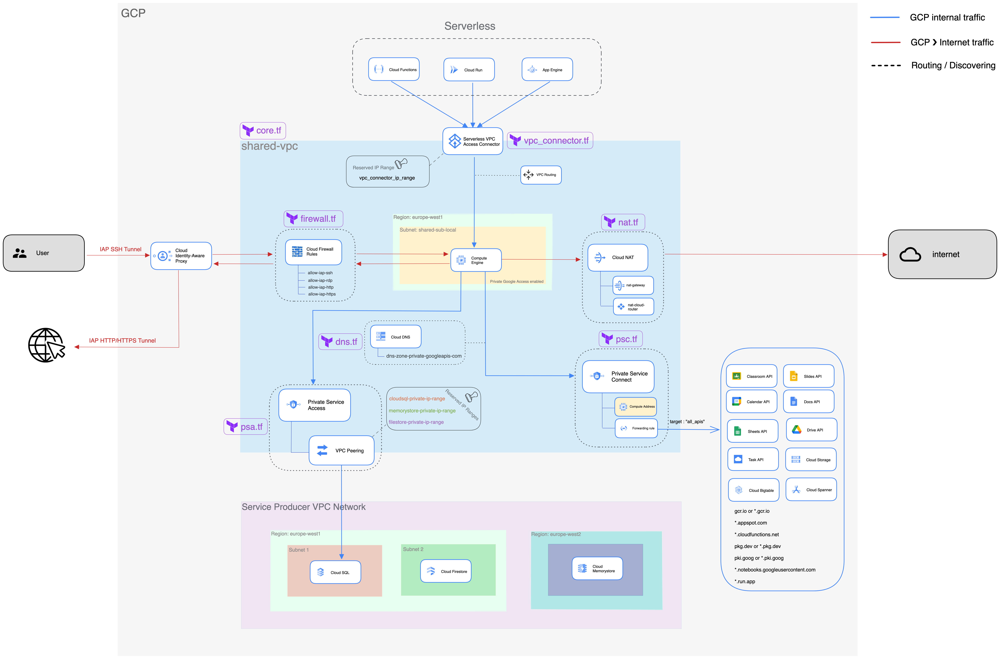

# Terraform GCP Network Core Module


 


This module covers the core concepts of a GCP network, it allows you to provision a [shared VPC](https://cloud.google.com/vpc/docs/shared-vpc) along with many other network componenets that you may need to establish a **secure** and **private** connection between your workloads on GCP and Google apis / internet.

## Compatibility

This module is meant for use with Terraform 1.2.3+.

## Prerequisites

You need to have a project with google cloud billing enabled.
This module will make that project a **Host project** by enabling shared VPC. You need also to activate the following list of APIs :
- Compute Engine API ❯❯ `compute.googleapis.com`
- Serverless VPC Access API ❯❯ `vpcaccess.googleapis.com`
- Cloud DNS API ❯❯ `dns.googleapis.com`
- Service Networking API ❯❯ `servicenetworking.googleapis.com`
- Service Directory API ❯❯ `servicedirectory.googleapis.com`
- Firewall Insights API ❯❯ `firewallinsights.googleapis.com`
- Cloud Identity-Aware Proxy API ❯❯ `iap.googleapis.com`
- Network Management API ❯❯ `networkmanagement.googleapis.com`
- Service Usage API ❯❯ `serviceusage.googleapis.com`
- Serverless VPC Access API ❯❯ `vpcaccess.googleapis.com`

## Overview


| File | Description  |
| --- | --- |
| core.tf     | [Provisioning Shared VPC and a subnet](https://cloud.google.com/vpc/docs/provisioning-shared-vpc) |
| vpc_connector.tf | [Configuring Serverless VPC Access](https://cloud.google.com/vpc/docs/configure-serverless-vpc-access)  |
| firewall.tf | [Create Firewall rules](https://cloud.google.com/vpc/docs/using-firewalls) |
| nat.tf | [Configure Cloud Nat](https://cloud.google.com/nat/docs/set-up-manage-network-address-translation) |
| dns.tf | [Set up a managed zone and create records](https://cloud.google.com/dns/docs/zones) |
| pcs.tf | [Configure Private Service Connect](https://cloud.google.com/vpc/docs/configure-private-service-connect-apis) |
| pca.tf | [Configure Private Service Access](https://cloud.google.com/vpc/docs/configure-private-services-access) |

## Dependencies
This work relies on the following official Terraform modules (module call):
- [ ] [Terraform VPC Module v5.1.0](https://github.com/terraform-google-modules/terraform-google-network/tree/v5.1.0/modules/vpc)
- [ ] [Terraform Google Cloud DNS Module v3.0.0](https://github.com/terraform-google-modules/terraform-google-cloud-dns/tree/v3.0.0)

## Example Usage
```terraform
module "gcp-core-network" {
  source  = "git::ssh://git@github.com/Abdelwaheb-Hnaien/gcp-core-network.git?ref=v0.1.0"

  perimeter = "prod"

  org_prefix = "my-org"

  host_project_id = "shared-xpn-project"

  shared_vpc_name = "my-org-shared-vpc"

  subnets = [
      {
          subnet_name           = "my-org-shared-sub-local"
          subnet_ip             = "10.10.0.0/17"
          subnet_region         = "europe-west1"
          subnet_private_access = "true"
          subnet_flow_logs      = "true"
          description           = "local subnet"
      },
  ]

  private_service_connect_ip = "172.28.144.12"

  cloudsql_ip_range = "172.28.240.0/21"

  memorystore_ip_range = "172.28.252.0/22"

  filestore_ip_range = "172.28.248.0/22"

  vpc_connector_ip_range = "172.28.144.13/28"
}

```

## Inputs
| Name | Description  | Type | Default  | Required  |
| --- | --- | --- | --- | --- |
| host_project_id | Host Project ID | String | n/a | yes |
| perimeter | Your Google Cloud environment(example : "prod", "dev", etc.)  | String | n/a  | yes  |
| org_prefix | Your Google Cloud organization prefix (example: "my-org")  | String | n/a  | yes (at least one subnet)  |
| shared_vpc_name | Shared VPC Name  | String | n/a  | yes  |
| subnets | Subnets to be created in the Shared VPC  | list(map(string)) | n/a  | yes  |
| private_service_connect_ip | Private service endpoint  | String | n/a  | yes  |
| cloudsql_ip_range | Private service Connection : Cloud SQL IP Range  | String | n/a  | yes  |
| memorystore_ip_range | Private service Connection : Memorystore IP Range  | String | n/a  | yes  |
| filestore_ip_range | Private service Connection : Filestore IP Range  | String | n/a  | yes  |
| vpc_connector_ip_range | VPC Serverless Access : VPC connector IP | String | n/a  | yes  |

## Outputs
| Name | Description  |
| --- | --- |
network	| The VPC resource being created |
network_id |	The ID of the VPC being created |
network_name | The name of the VPC being created |
network_self_link	| The URI of the VPC being created |
project_id | VPC project id |

## Contribution
Please feel free to fork the repository and submit a pull request if you think there is an issue or simply if you would like make this project better.
